# Protofire Safe - Beginner's Guide

> **Protofire Safe** is a fork of [Safe{Wallet}](https://safe.global/) maintained by [Protofire](https://protofire.io/), deployed across a range of EVM-compatible networks including Plasma, Tempo, Moca and Blast.

---

## Table of Contents

1. [What is Safe?](#1-what-is-safe)
2. [Before You Start](#2-before-you-start)
3. [Creating a Safe](#3-creating-a-safe)
4. [Setting Up a Reliable Signer Structure](#4-setting-up-a-reliable-signer-structure)
5. [Proposing a Transaction](#5-proposing-a-transaction)
6. [Signing a Transaction](#6-signing-a-transaction)
7. [Executing a Transaction](#7-executing-a-transaction)
8. [Connecting to dApps via WalletConnect](#8-connecting-to-dapps-via-walletconnect)
9. [Validating Transactions with Safe Utils](#9-validating-transactions-with-safe-utils)
10. [Troubleshooting](#10-troubleshooting)

---

## 1. What is Safe?

Safe (formerly Gnosis Safe) is a **smart contract wallet** that requires multiple approvals before any transaction can be executed. Unlike a regular wallet controlled by a single private key, Safe uses a **multisignature (multisig)** model:

- You define a group of **owner addresses** (signers).
- You set a **threshold** - the minimum number of signers required to approve a transaction.
- A `2-of-3` Safe, for example, needs any 2 of its 3 owners to sign before anything moves.

```
┌─────────────────────────────────────────────┐
│              Safe Contract                  │
│                                             │
│  Owners:  Alice  Bob  Carol                 │
│  Threshold:  2 of 3                         │
│                                             │
│  Transaction only executes when             │
│  ≥2 valid signatures are collected.         │
└─────────────────────────────────────────────┘
```

| Threat | Regular Wallet | Safe |
|---|---|---|
| One key compromised | Funds stolen | Attacker still needs more signers |
| One key lost | Funds lost forever | Remaining signers can still operate |
| Insider attack | No protection | Requires collusion of threshold-many signers |
| Accidental transaction | No undo | Requires threshold approval before execution |

Protofire Safe extends this security model to additional EVM networks not available on the official Safe{Wallet} deployment.

---

## 2. Before You Start

You need:

- **A Web3 wallet** (MetaMask, Ledger, Trezor, or any WalletConnect-compatible wallet) for each intended signer.
- **Native tokens for gas** on the network you plan to use - creating a Safe requires one on-chain transaction.
- **Addresses of all intended co-signers** collected before you begin.

Open the Protofire Safe interface in your browser.

>
> 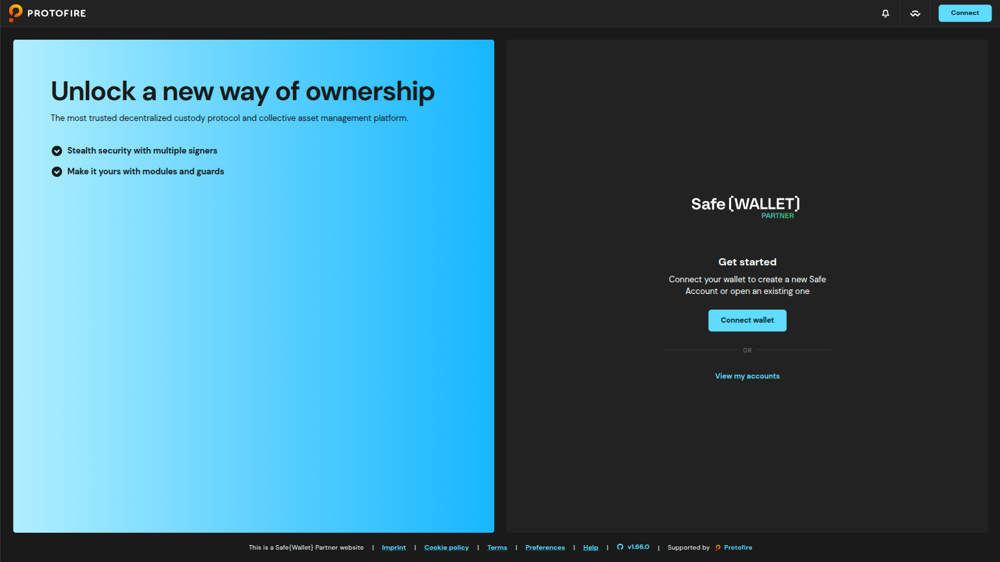
> *The Protofire Safe home screen. Network selector is in the top-right corner.*

Click **Connect Wallet** and choose your wallet provider.

>
> 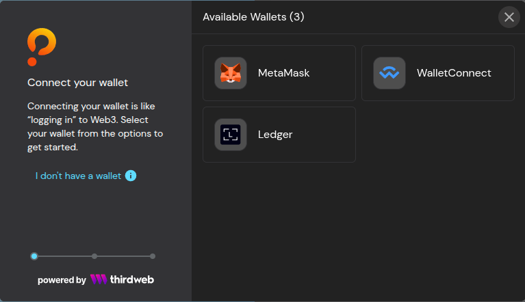
> *Wallet connection modal showing MetaMask, WalletConnect, and hardware wallet options.*

After connecting, check the **network** shown in the top-right corner. If it doesn't match where you want to deploy, switch networks in your wallet - Safe will update to match.

---

## 3. Creating a Safe

### Step 1 - Start the setup wizard

Click **Create Account** on the home screen.

>
> 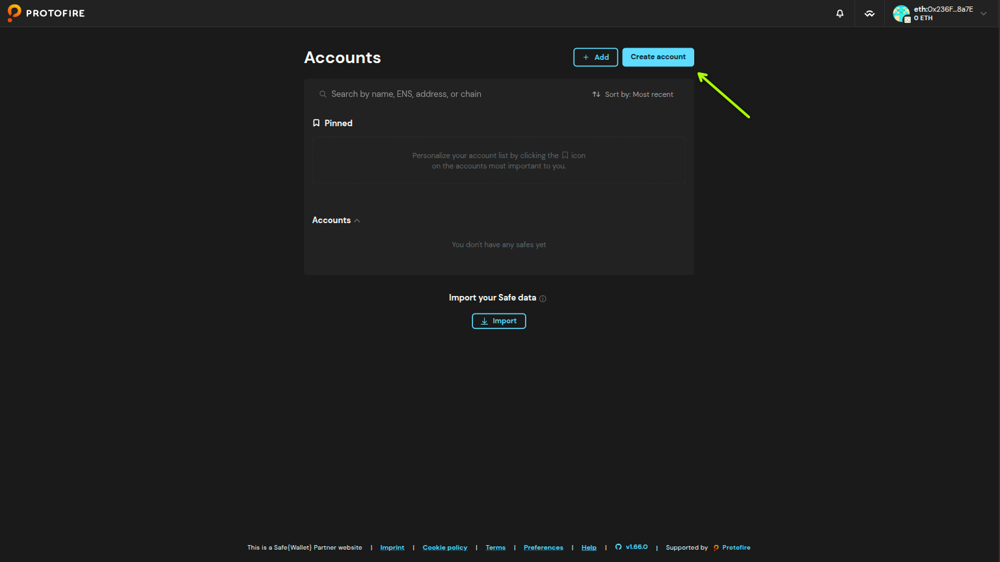
> *The "Create Account" button on the dashboard.*

### Step 2 - Name your Safe

Give your Safe a name. It's stored locally in your browser and is only visible to you.

>
> 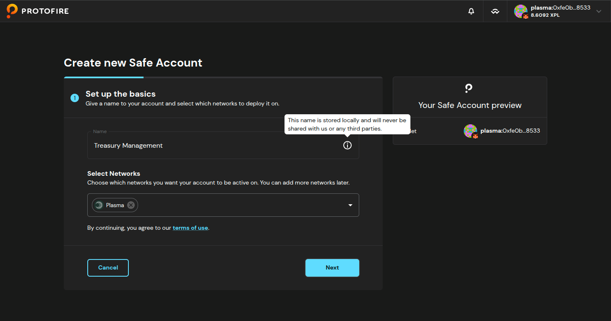
> *Safe name input field. The name is local-only and can be changed later.*

Click **Next**.

### Step 3 - Add signers and set the threshold

Add the address of each signer and set the threshold - how many of them must sign before any transaction executes. Your connected wallet appears as the first signer by default. Click **Add new signer** for each additional owner.

>
> 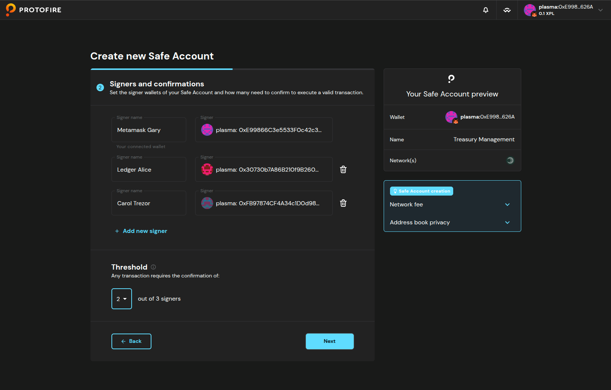
> *The signers setup screen. Each row is one owner address. The threshold selector is at the bottom.*

Give each signer a recognisable label (e.g. "Alice - Ledger", "Bob - MetaMask"). Labels are stored locally and make it easy to track who has signed.

Click **Next**.

### Step 4 - Review and deploy

| Field | What to check |
|---|---|
| Network | Correct chain selected |
| Owners | All addresses are correct - double-check every character |
| Threshold | Matches your intended policy |
| Estimated gas | You have enough native tokens to cover it |

>
> 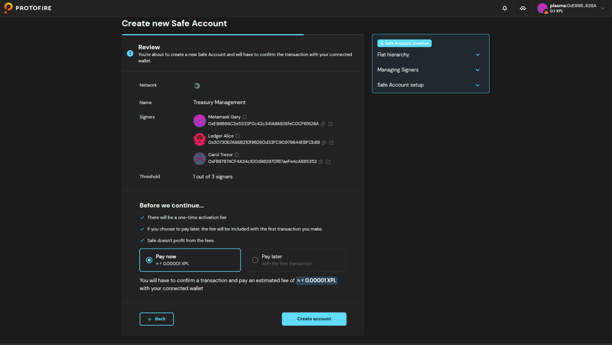
> *The review screen before deployment. Verify every owner address and the threshold.*

Click **Create account** - your wallet will ask you to sign the deployment transaction.

### Step 5 - Wait for confirmation

The transaction confirms on-chain, usually within 30 seconds. You'll see a loading screen in the meantime.

>
> 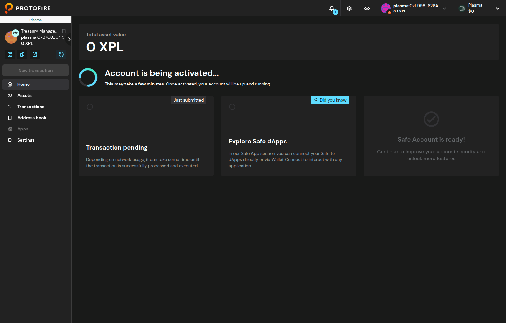
> *Pending creation screen.*

Once confirmed, Safe opens your new dashboard.

>
> 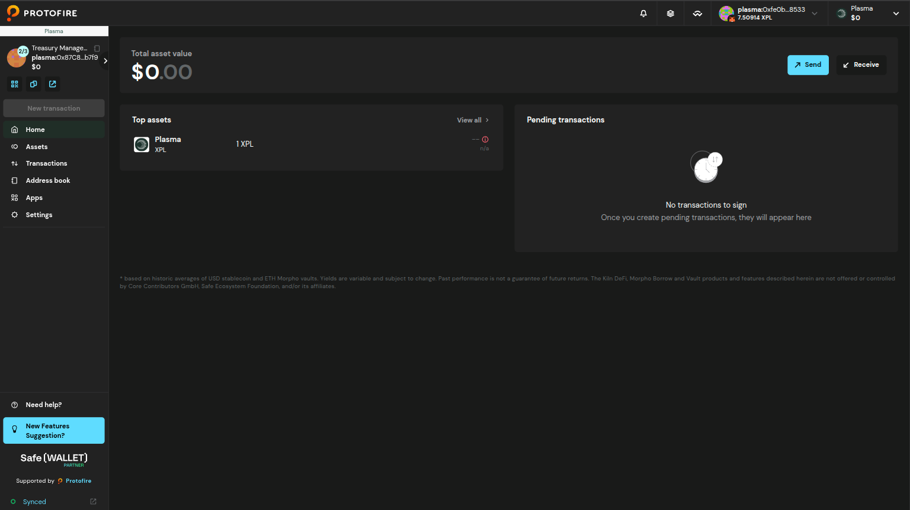
> *Your Safe's dashboard showing the address, balance, and pending transactions.*

**Copy your Safe address and share it with your co-signers** so they can connect to it from their own browsers.

---

## 4. Setting Up a Reliable Signer Structure

The signer configuration is your security model.

### Choosing a threshold

| Scenario | Recommended threshold |
|---|---|
| Personal Safe (extra security layer) | 1-of-1 (adds smart contract features) or 1-of-2 (hot + cold key) |
| Small team treasury (2–4 people) | 2-of-3 |
| Larger team or high-value treasury | 3-of-5 or higher |
| DAO or protocol treasury | Often 4-of-7 or more |

**Rule of thumb:** keep the threshold above half the total owners so no simple majority can act unilaterally, but low enough that you aren't blocked whenever one signer is unavailable.

### Signer device diversity

Don't put all your signers on the same device type or under one person's control:

```
Good signer mix (2-of-3 example):
  ✔ Alice   - Ledger hardware wallet (cold)
  ✔ Bob     - MetaMask on a dedicated signing machine (warm)
  ✔ Carol   - Trezor hardware wallet (cold)

Risky signer mix to avoid:
  ✘ Three browser wallets on the same laptop
  ✘ Three keys held by the same person
  ✘ All signers on the same exchange hot wallet
```

### Key storage

- **Hardware wallets** (Ledger, Trezor, GridPlus Lattice) for any signer holding significant assets.
- **Different seed phrases** for each signer - never derive multiple signer keys from one mnemonic.
- **Offline backup** of every seed phrase in a physically separate location.
- **No cloud storage** (Google Drive, iCloud, Dropbox) of private keys or seed phrases.

### Adding or removing signers later

The owner list and threshold can be changed after deployment, but that change itself requires the current threshold to be met:

> Settings → Safe account settings → Owners → Add owner / Remove owner

Every change is an on-chain transaction and costs gas.

---

## 5. Proposing a Transaction

Any owner can propose a transaction. It's stored off-chain in the Safe Transaction Service and immediately visible to all other owners.

### Native token transfer example

1. Click **New transaction → Send tokens** from your Safe dashboard.

>
> 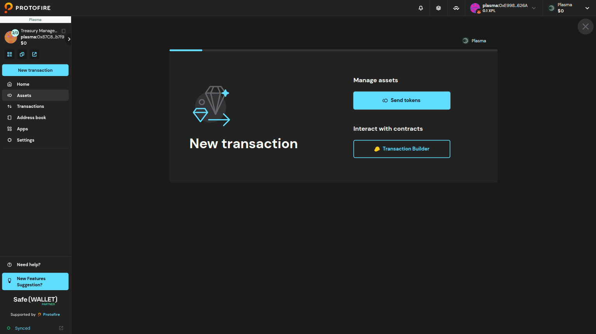
> *The "New transaction" page, showing Send tokens and Contract interaction options.*

2. Fill in the recipient address and amount.

>
> 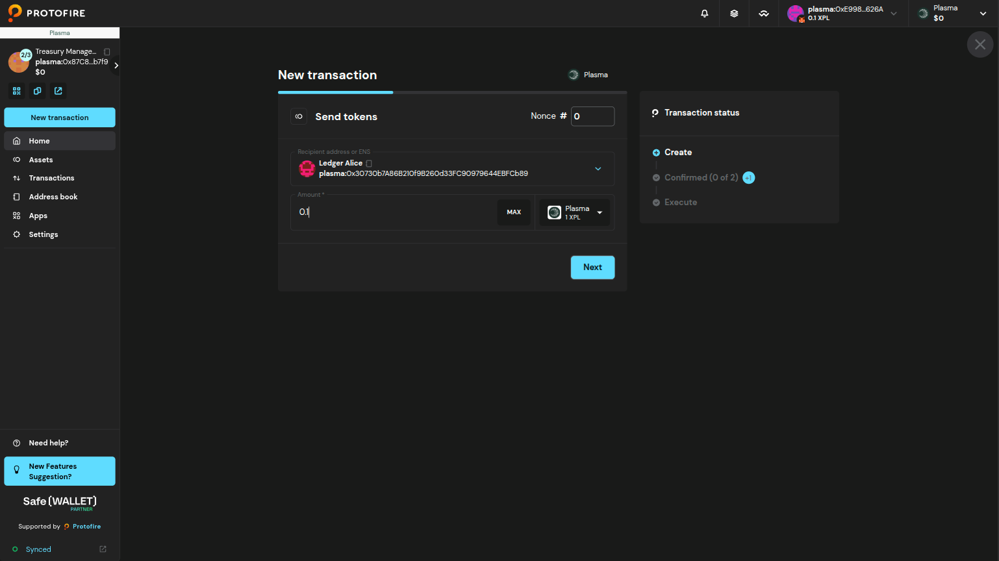
> *The send tokens form. Verify the recipient address character by character.*

3. Click **Next**, then **Sign** - this submits the proposal and adds your signature.

> Signing here is gas-free: it creates an off-chain EIP-712 message. No on-chain transaction happens yet - only the final execution step costs gas.

---

## 6. Signing a Transaction

Co-signers find the pending transaction in **Transactions → Queue**.

>
> 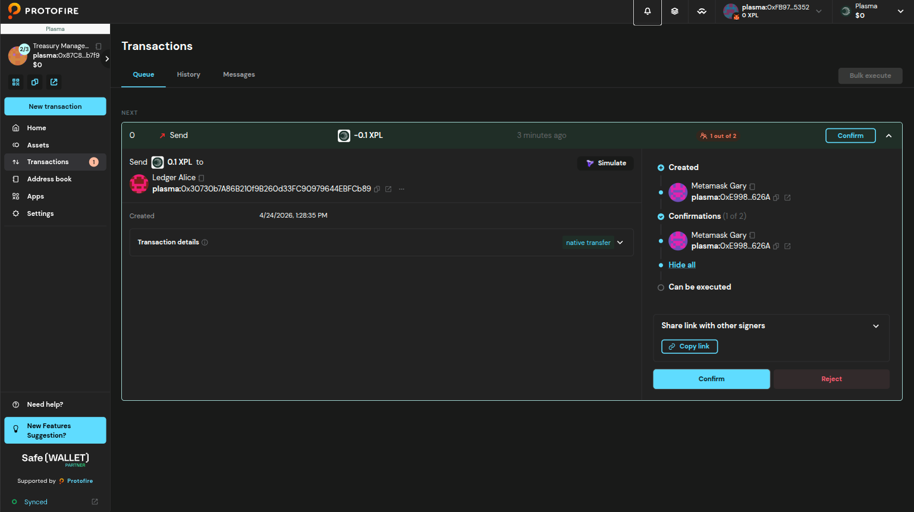
> *The transaction queue showing pending transactions and how many confirmations have been collected.*

1. Click the transaction to open its details.
2. Review **every field**: recipient, value, data (if any), and nonce.
3. Click **Confirm**.

>
> 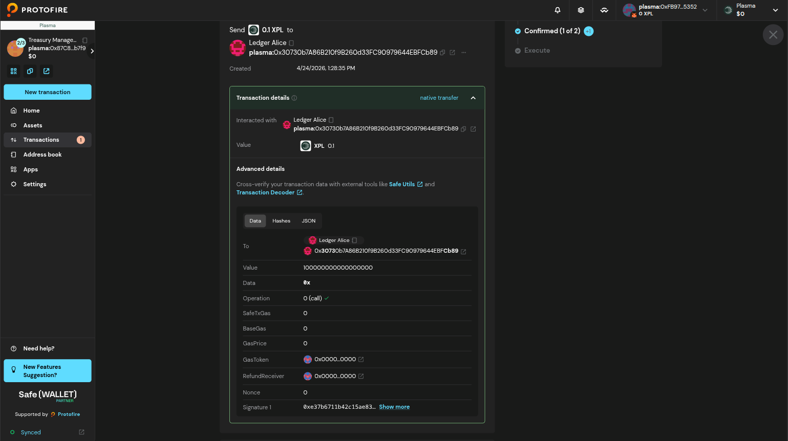
> *Confirmation modal showing the transaction hash and parameters.*

4. Your wallet opens with the EIP-712 structured data message. On MetaMask it looks like:

>
> 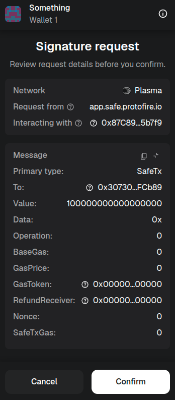
> *MetaMask's EIP-712 signing prompt showing the Safe's domain (contract address, chain ID) and transaction parameters.*

5. Check that the values match what you saw in Safe, then click **Sign**.

No gas is spent. Repeat until the threshold is reached.

---

## 7. Executing a Transaction

Once enough signatures are collected (≥ threshold), an **Execute** button appears on the transaction.

>
> 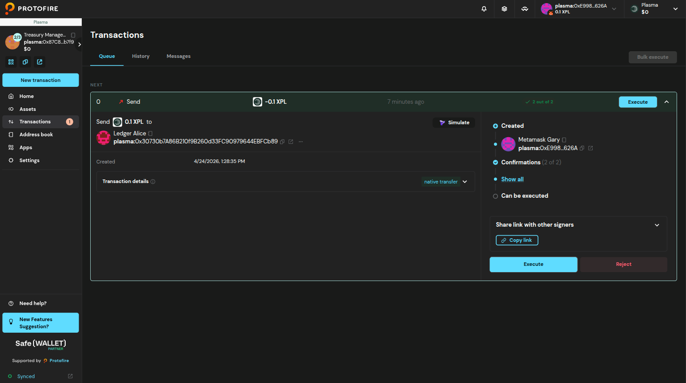
> *A transaction with enough confirmations. The "Execute" button is now active.*

Any owner - or any address with enough gas - can execute:

1. Click **Execute**.
2. Review the gas estimate.
3. Confirm in your wallet - this is an **on-chain transaction** and costs gas.

>
> 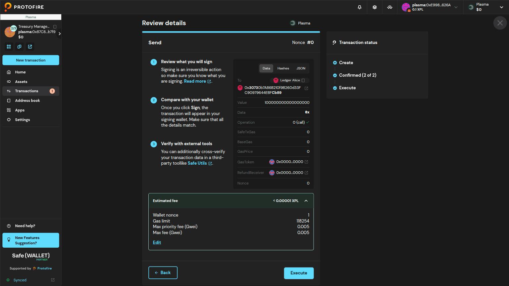
> *Execution confirmation showing the gas cost estimate.*

After the transaction mines, it moves from **Queue** to **History** with a link to the block explorer.

>
> 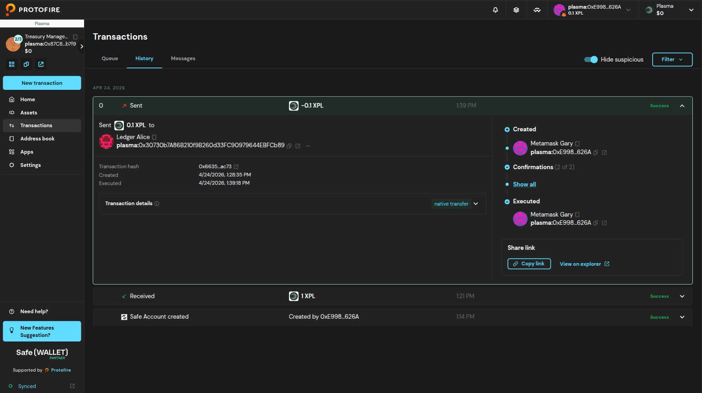
> *Completed transaction in the History tab.*

---

## 8. Connecting to dApps via WalletConnect

WalletConnect lets you use your Safe as the wallet on any external dApp - DeFi protocols, governance platforms, NFT marketplaces - the same way you'd connect MetaMask, but with multisig security behind every action.

```
┌──────────┐   WalletConnect    ┌──────────────┐
│   dApp   │ ◄────────────────  │ Protofire    │
│ (Uniswap │    paired session  │    Safe      │
│  Aave…)  │ ──────────────────►│              │
└──────────┘  tx proposal sent  └──────┬───────┘
                                       │ threshold signers approve
                                       ▼
                                  on-chain execution
```

### How it differs from a regular wallet

When you confirm an action in a dApp connected to MetaMask, it executes immediately. With Safe it doesn't - the dApp sends a proposal to your Safe queue, and the transaction only goes on-chain after the threshold of signers approve it and someone executes it. A few practical consequences:

- The dApp may appear to hang after you confirm - it's waiting for a tx hash that won't arrive until Safe executes.
- Time-sensitive transactions (swaps with short deadlines, liquidation triggers) can expire before the threshold is reached. Make sure co-signers are reachable before initiating.

---

### Step 1 - Open the WalletConnect panel

Click the **WalletConnect** icon in the Safe left sidebar or top navigation.

>
> 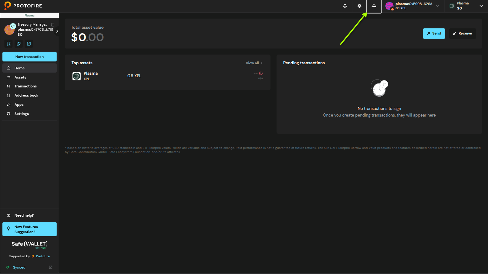
> *The WalletConnect icon in the Safe sidebar.*

>
> 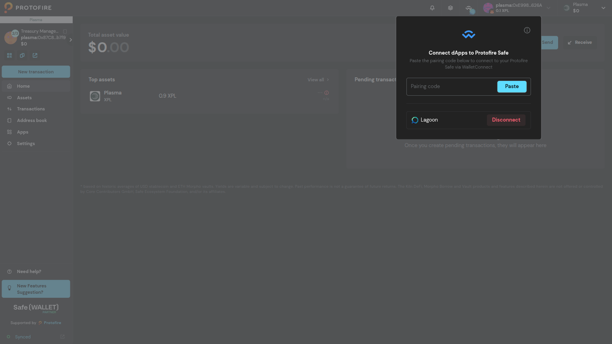
> *The WalletConnect panel with the URI paste field and any active sessions.*

---

### Step 2 - Get the connection URI from the dApp

In the dApp, click **Connect Wallet** and choose **WalletConnect**. The dApp displays either a QR code or a URI starting with `wc:`. Copy the full URI string.

>
> 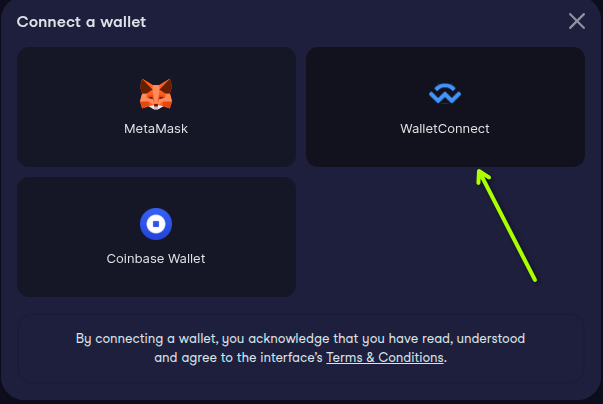
> *dApp wallet selection screen. Choose "WalletConnect" to get a URI or QR code.*

>
> 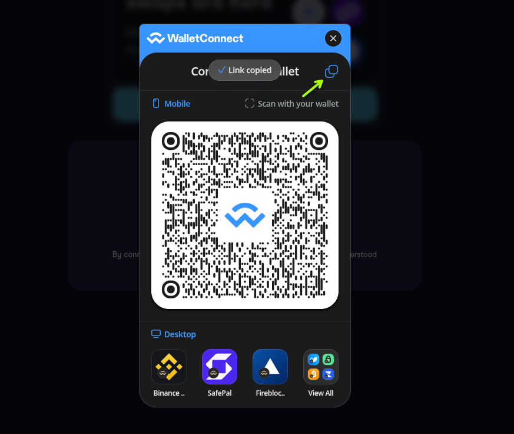
> *Click Copy button to copy URI to your clipboard:".*
---

### Step 3 - Paste the URI into Safe

Paste the URI into the WalletConnect panel and click **Approve** (or press Enter). The pairing completes automatically and the dApp shows your Safe address as the connected wallet within a few seconds.

>
> 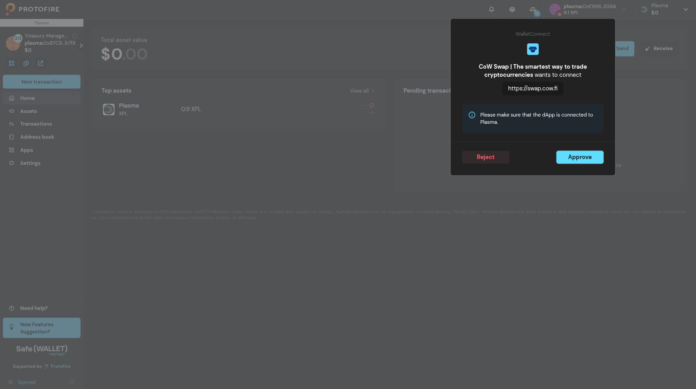
> *Paste the "wc:…" URI and click Approve.*

>
> 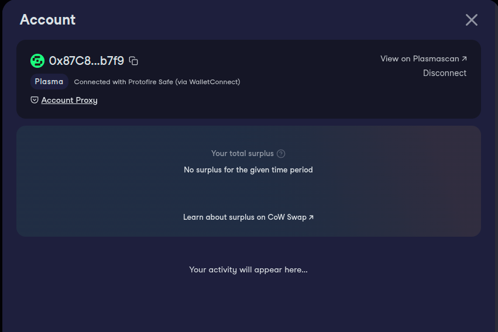
> *The dApp confirms the connection with your Safe address.*

---

### Step 4 - Interact with the dApp

Use the dApp as you normally would. When you confirm an action, the dApp sends a transaction request to Safe.

>
> 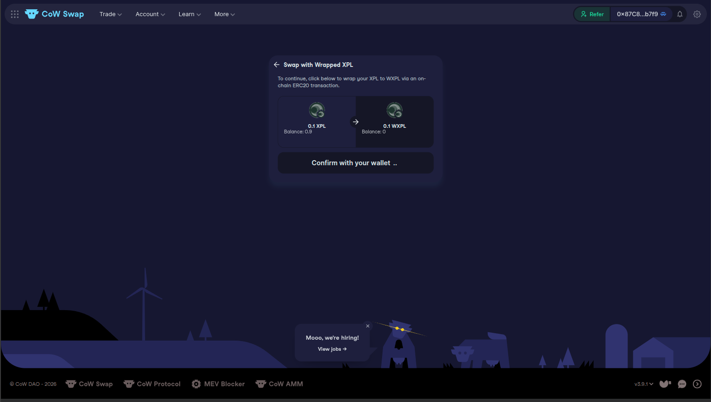
> *Confirming an action in the dApp queues it in Safe - it does not execute immediately.*

---

### Step 5 - Approve the transaction in Safe

The transaction appears in **Transactions → Queue**, just like any other proposal.

>
> 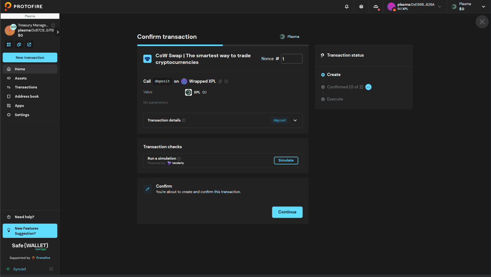
> *The dApp transaction in the Safe queue, showing destination contract and calldata.*

Check these fields before signing:

- **To** - should be the dApp's contract (e.g. Uniswap router, Aave lending pool), not an unknown address.
- **Value** - native tokens being sent; 0 for most ERC-20 interactions.
- **Data** - hex calldata for the function call. If you don't recognise it, decode it on a block explorer first.

Collect signatures as in [Section 6](#6-signing-a-transaction) and execute as in [Section 7](#7-executing-a-transaction).

---

### Managing active connections

Reopen the WalletConnect panel to see all paired sessions.

>
> 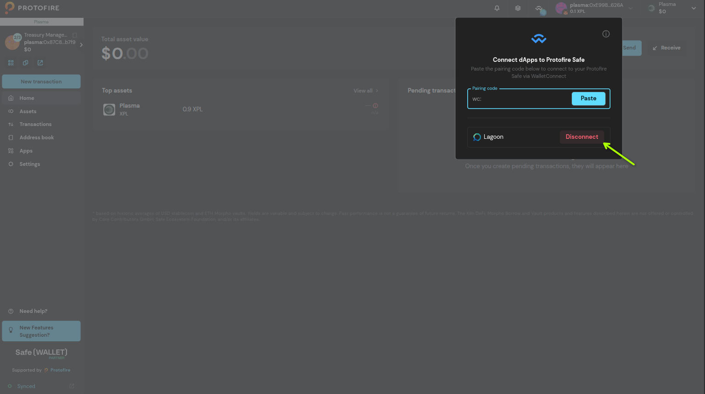
> *All currently paired dApps. Click the Disconnect button next to a session to disconnect.*

Disconnect sessions you're not actively using - an open session is a channel a compromised dApp could use to push transactions into your queue.

---

### Compatibility notes

Not every dApp handles Safe's async signing gracefully:

| Symptom | Cause | What to do |
|---|---|---|
| dApp spins forever after you confirm | dApp waits for an immediate tx hash | Wait for Safe to execute, then refresh the dApp |
| dApp reports "transaction failed" straight away | dApp timed out before threshold was reached | Get co-signers to sign faster; consider a lower threshold for time-sensitive ops |
| No WalletConnect option in dApp | dApp supports injected wallets only | Use the Safe Apps browser instead - see below |
| Session drops unexpectedly | WalletConnect v1 sessions expire | Reconnect with a fresh URI from the dApp |

### Safe Apps browser

For dApps natively integrated with Safe, use the **Apps** section in the sidebar instead of WalletConnect. They run inside Safe's built-in browser and handle the multisig flow more reliably than an external WalletConnect session.

>
> 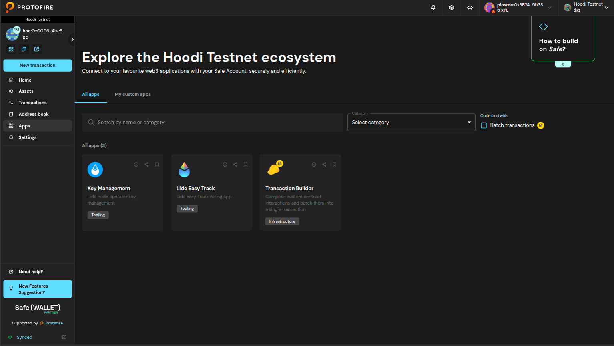
> *The Safe Apps browser with available integrated dApps.*

---

## 9. Validating Transactions with Safe Utils

[Safe Utils](https://safeutils.protofire.io/) ([GitHub](https://github.com/protofire/safe-utils)) is a Protofire tool that independently calculates Safe transaction hashes using EIP-712. Use it to confirm that the hash your wallet displays matches the transaction parameters you reviewed in the UI.

### Why bother?

Hardware wallets show a raw hash, not the human-readable parameters. Safe Utils recomputes that hash from scratch so you can verify nothing was changed between the UI and the signing request.

```
Safe UI shows:  Send 1.0 ETH to 0xABC...
                ↓ hashed by EIP-712
Wallet shows: 0x7f3d...e1c9

Safe Utils:     Enter same parameters
                → produces 0x7f3d...e1c9  ✔ Match - safe to sign
                → produces 0x9a1b...f204  ✘ Mismatch - DO NOT SIGN
```

### Step by step

#### Step 1 - Open Safe Utils

Go to [safeutils.protofire.io](https://safeutils.protofire.io/).

>
> 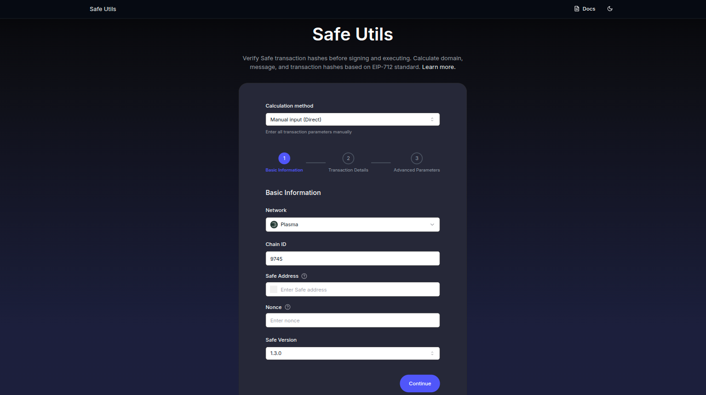
> *Safe Utils home page with network selector and input method toggle.*

#### Step 2 - Select the network

Pick the network your Safe is deployed on.

>
> 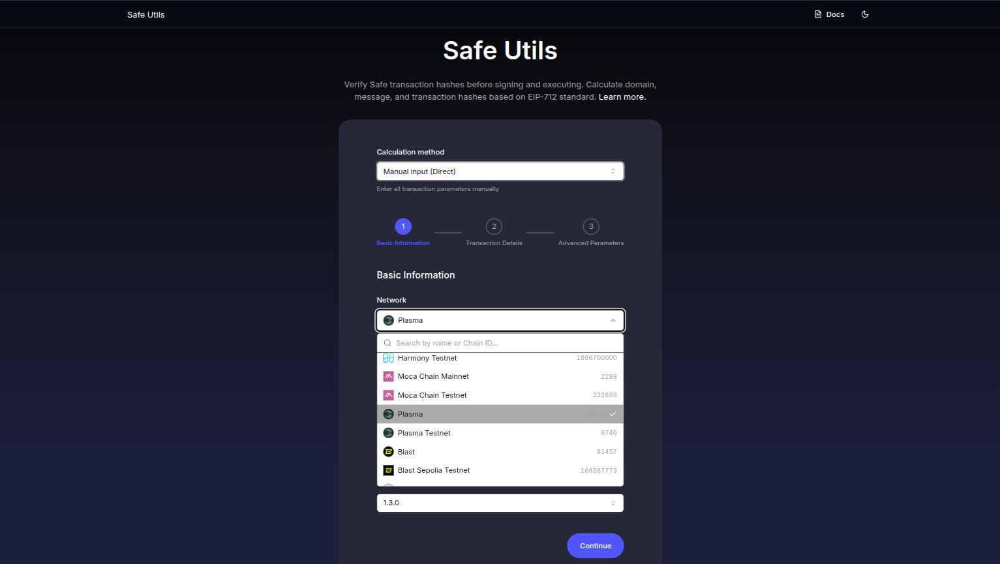
> *Network dropdown in Safe Utils.*

#### Step 3 - Load the transaction

The quickest way: enter your **Safe address** and the **transaction nonce** (visible in the Safe UI transaction details). Safe Utils fetches the parameters from the Safe Transaction Service automatically.

>
> 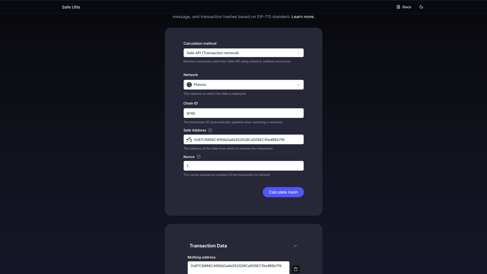
> *Enter Safe address and nonce, then click "Calculate Hash".*

Alternatively, switch to **manual input** and fill in each field:

| Parameter | Where to find it |
|---|---|
| Safe address | Your Safe's address |
| To | Recipient address |
| Value | Amount in wei (ETH × 10¹⁸) |
| Data | Hex calldata (0x for plain transfers) |
| Operation | 0 = Call, 1 = DelegateCall |
| safeTxGas | Usually 0 |
| baseGas | Usually 0 |
| gasPrice | Usually 0 |
| gasToken | 0x000...000 for native token |
| refundReceiver | 0x000...000 |
| Nonce | Transaction nonce (from Safe UI) |

>
> 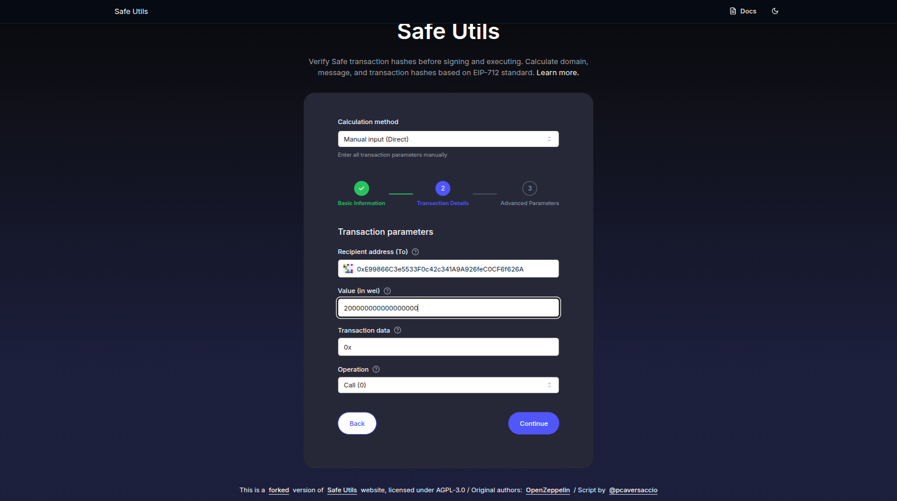
> *Manual input form.*

#### Step 4 - Compare the hashes

Click **Calculate**. Safe Utils shows:

- **Domain Hash** - derived from the Safe contract address and chain ID.
- **Message Hash** - derived from the transaction parameters.
- **Safe Transaction Hash** - the hash your hardware wallet will display.

>
> 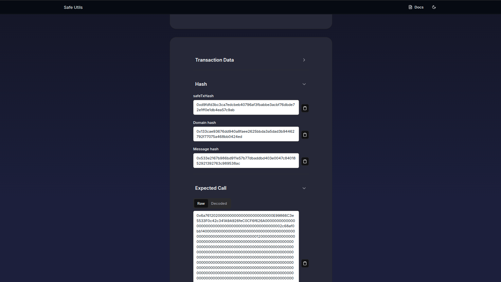
> *Safe Utils output: Domain Hash, Message Hash, and Safe Transaction Hash.*

Cross-check the Safe Transaction Hash against:

1. The hash shown on your hardware wallet screen.
2. The `safeTxHash` in Safe UI's transaction details.

All three must match. If anything differs, stop - don't sign until you know why.

---

## 10. Troubleshooting

### "Not enough signatures" when trying to execute

The transaction hasn't reached the threshold yet. Share the transaction link with remaining co-signers and ask them to confirm.

### Wrong network in Safe Utils

The Domain Hash encodes the chain ID, so a wrong network selection will always produce a wrong hash. Select the same network your Safe is on.

### Transaction stuck in queue

Safe executes nonces sequentially - a transaction with a lower nonce must go first. Check whether an older pending transaction is blocking the queue.

### A signer lost their key

If you still have enough active signers to meet the threshold, submit an owner removal transaction via:

> Settings → Safe account settings → Owners → Remove owner

If you've lost enough keys to fall below the threshold, the Safe is permanently locked.

### Hardware wallet shows an unreadable hash

Hardware wallets show the final EIP-712 hash, not the raw parameters. Use **Safe Utils** (see [Section 9](#9-validating-transactions-with-safe-utils)) to independently verify it.

---

## Further Resources

| Resource | Link |
|---|---|
| Protofire Safe source code | https://github.com/protofire/safe-wallet-web |
| Safe Utils (Protofire fork) | https://github.com/protofire/safe-utils |
| Safe Utils web app | https://safeutils.protofire.io/ |
| Official Safe documentation | https://docs.safe.global/ |
| EIP-712 standard | https://eips.ethereum.org/EIPS/eip-712 |
| Protofire website | https://protofire.io/ |

---
